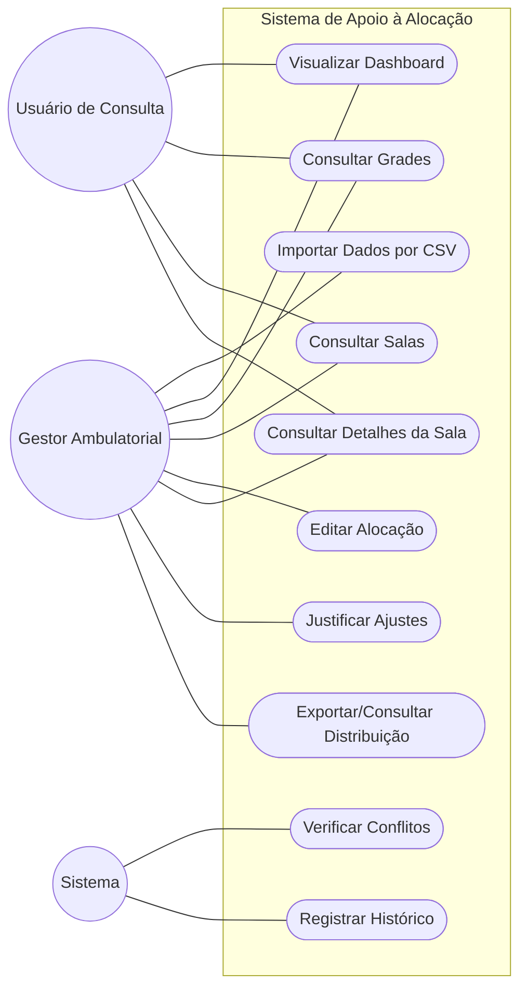

# Modelagem de Casos de Uso

## 1. Diagrama de Casos de Uso

## 2. Especificação (Exemplo)
### UC001 - Importar Dados por CSV
* **Ator**: Gestor Ambulatorial.
* **Fluxo**: Acessar tela de importação → Selecionar tipo de arquivo → Enviar CSV → Validar dados → Importar.

#### [CARE-UC001] Implementação da Importação
* **Context**: Necessidade de carregar dados iniciais do MVP (grades, salas, restrições e alocações).
* **Action**: O sistema lê o arquivo, valida a presença de colunas obrigatórias e aponta campos ausentes ou dados inválidos.
* **Result**: Dados válidos são importados, atualizando o dashboard operacional.
* **Evaluation**: O sistema deve rejeitar CSVs incompletos com clareza, carregar arquivos válidos com sucesso e atualizar todas as telas automaticamente.

### UC002 - Visualizar Dashboard Operacional
* **Ator**: Gestor Ambulatorial.
* **Fluxo**: Acessar Dashboard → Visualizar indicadores gerais → Selecionar filtros (dia/turno) → Analisar situação.

#### [CARE-UC002] Implementação do Dashboard
* **Context**: Obtenção de uma visão consolidada da ocupação das salas no turno selecionado.
* **Action**: Renderizar cards de totais (salas disponíveis, bloqueadas, em reforma), grid visual de salas e tabela de ocupação.
* **Result**: Painel atualizado dinamicamente refletindo o status real e os conflitos encontrados.
* **Evaluation**: Indicadores devem responder aos filtros e as salas com conflitos ou bloqueios devem possuir destaque visual claro.

### UC003 - Consultar Grades de Atendimento
* **Ator**: Gestor Ambulatorial, Usuário de Consulta.
* **Fluxo**: Acessar tela de grades → Selecionar dia/turno → Listar grades correspondentes.

#### [CARE-UC003] Implementação da Consulta de Grades
* **Context**: Visualizar a demanda de atendimento exigida por turno.
* **Action**: Exibir a lista de demandas com identificador, especialidade, profissional, e quantidade de salas necessárias.
* **Result**: Usuário tem a visibilidade de todas as grades e filtra conforme necessidade.
* **Evaluation**: Garantir que as grades que não possuem sala associada sejam facilmente identificadas.

### UC004 - Consultar Salas Ambulatoriais
* **Ator**: Gestor Ambulatorial, Usuário de Consulta.
* **Fluxo**: Acessar tela de salas → Aplicar filtros (status, bloco, especialidade) → Visualizar lista de salas.

#### [CARE-UC004] Implementação da Consulta de Salas
* **Context**: Visualizar o inventário de salas cadastradas e suas características físicas.
* **Action**: Listar as salas exibindo número, bloco, andar, status, acessibilidade, equipamentos e situação (bloqueio/reforma).
* **Result**: Inventário disponível para consulta com diferenciação de salas restritas.
* **Evaluation**: Salas bloqueadas ou com equipamentos específicos devem ser claramente identificadas visualmente.

### UC005 - Verificar Conflitos Automaticamente
* **Ator**: Sistema.
* **Ator Interessado**: Gestor Ambulatorial
* **Fluxo**: Ler dados → Cruzar informações com regras → Classificar conflitos → Exibir no painel.

#### [CARE-UC005] Implementação do Motor de Conflitos
* **Context**: Identificar inconsistências operacionais sem a necessidade de intervenção humana (ex: sala em reforma sendo utilizada, alocação dupla).
* **Action**: Aplicar algoritmo de cruzamento de regras sobre a distribuição atual sempre que houver alteração de dados ou carga.
* **Result**: Conflitos classificados por gravidade exibidos no dashboard e nos detalhes da sala.
* **Evaluation**: Verificação deve rodar em background. Conflitos críticos devem gerar alerta visível e recalculados automaticamente após qualquer ajuste.

### UC006 - Editar Alocação de Sala
* **Ator**: Gestor Ambulatorial.
* **Fluxo**: Selecionar alocação → Escolher nova sala → Verificar conflitos → Confirmar alteração.

#### [CARE-UC006] Implementação de Ajuste Manual
* **Context**: Alterar manualmente o ensalamento de uma grade.
* **Action**: Processar a troca da sala associada à grade, rodando o validador de conflitos antes da gravação.
* **Result**: Alocação atualizada, novos conflitos recalculados e alteração salva no histórico.
* **Evaluation**: Sistema deve impedir seleção de sala inexistente/bloqueada sem alerta e registrar toda alteração no histórico.

### UC007 - Consultar Detalhes de uma Sala
* **Ator**: Gestor Ambulatorial, Usuário de Consulta.
* **Fluxo**: Clicar em uma sala no painel → Abrir modal de detalhes → Visualizar informações e alertas.

#### [CARE-UC007] Implementação do Detalhamento
* **Context**: Acesso rápido às informações completas e conflitos específicos de uma única sala.
* **Action**: Carregar modal com número, bloco, status, especialidade preferencial, profissionais alocados no dia/turno e alertas vinculados.
* **Result**: Visão granular entregue ao usuário.
* **Evaluation**: Dados completos da alocação e destaque evidente aos conflitos exclusivos daquela sala.

### UC008 - Registrar Histórico de Ajustes
* **Ator**: Sistema.
* **Fluxo**: Interceptar alteração manual → Coletar meta-dados (usuário, sala ant/nova, data/hora) → Persistir no log.

#### [CARE-UC008] Implementação da Auditoria
* **Context**: Rastreabilidade de alterações operacionais efetuadas no sistema.
* **Action**: Criar registro automatizado contendo a alocação alterada, o responsável, o estado anterior e novo, e conflitos associados.
* **Result**: Base de histórico auditável gerada.
* **Evaluation**: Todo ajuste manual deve invariavelmente gerar um log, garantindo o rastreio da responsabilidade pela ação.

### UC009 - Justificar Ajustes com Conflito
* **Ator**: Gestor Ambulatorial.
* **Fluxo**: Tentar alteração com alerta → Sistema exige motivo → Inserir justificativa → Salvar.

#### [CARE-UC009] Implementação de Bypass Justificado
* **Context**: Permissão de flexibilidade operacional, registrando formalmente o aceite de um risco/alerta.
* **Action**: Bloquear a confirmação de uma alocação conflitante até que o campo texto de justificativa seja preenchido.
* **Result**: Alocação concluída sob exceção documentada.
* **Evaluation**: Diferenciar erro bloqueante (não permitindo override) de alerta operacional (permitindo override com justificativa salva no log).

### UC010 - Exportar / Consultar Distribuição Consolidada
* **Ator**: Gestor Ambulatorial.
* **Fluxo**: Acessar visão consolidada → Aplicar filtros de dia/turno → Exportar/Visualizar relatório.

#### [CARE-UC010] Implementação da Exportação
* **Context**: Obtenção de relatórios e resumos operacionais em PDF/CSV para distribuição.
* **Action**: Formatar a matriz consolidada de salas, especialidades e profissionais ativos.
* **Result**: Arquivo ou visão tabular gerada e disponibilizada ao usuário.
* **Evaluation**: Garantir compatibilidade com formatos de saída (CSV/PDF) e manter a consistência dos dados com o painel real.