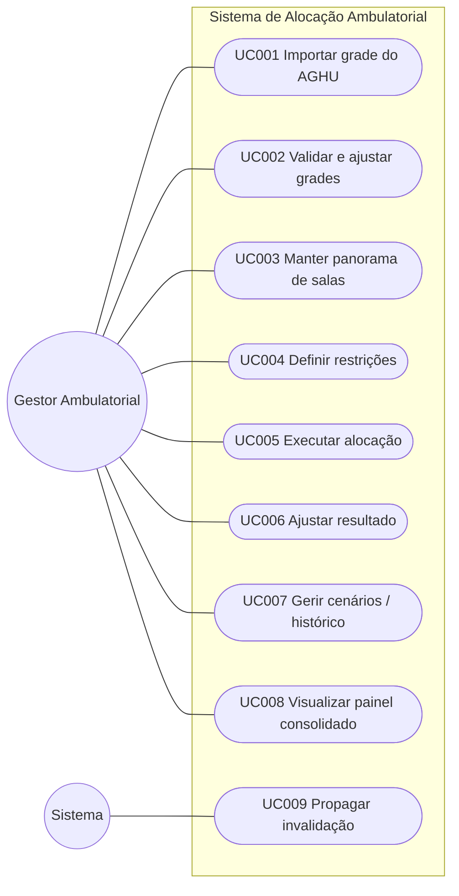
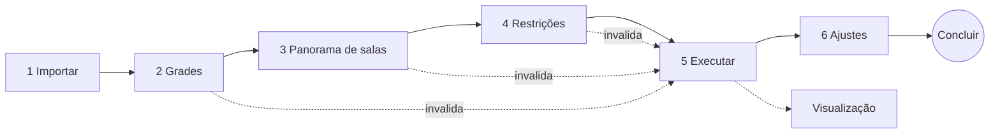

# Modelagem de Casos de Uso

O processo é uma máquina de estados de seis etapas, que o gestor percorre podendo voltar a qualquer uma. Um módulo de visualização, somente leitura, resume o resultado.

## 1. Diagrama de Casos de Uso

```mermaid
flowchart LR
    GA((Gestor Ambulatorial))
    SIS((Sistema))

    subgraph "Sistema de Alocação Ambulatorial"
        UC1([UC001 Importar grade do AGHU])
        UC2([UC002 Validar e ajustar grades])
        UC3([UC003 Manter panorama de salas])
        UC4([UC004 Definir restrições])
        UC5([UC005 Executar alocação])
        UC6([UC006 Ajustar resultado])
        UC7([UC007 Gerir cenários / histórico])
        UC8([UC008 Visualizar painel consolidado])
        UC9([UC009 Propagar invalidação])
    end

    GA --- UC1
    GA --- UC2
    GA --- UC3
    GA --- UC4
    GA --- UC5
    GA --- UC6
    GA --- UC7
    GA --- UC8

    SIS --- UC9
```

## 2. Fluxo das etapas

```mermaid
flowchart LR
    E1[1 Importar] --> E2[2 Grades]
    E2 --> E3[3 Panorama de salas]
    E3 --> E4[4 Restrições]
    E4 --> E5[5 Executar]
    E5 --> E6[6 Ajustes]
    E6 --> C((Concluir))
    E5 -.-> V[Visualização]
    E2 -. invalida .-> E5
    E3 -. invalida .-> E5
    E4 -. invalida .-> E5
```

## 3. Especificação

### UC001 - Importar grade do AGHU
* **Ator**: Gestor Ambulatorial.
* **Fluxo**: Acessar a importação → enviar o arquivo do AGHU → o sistema trata os dados → revisar a redução e as unidades participantes → salvar como cenário.

#### [CARE-UC001] Implementação da Importação
* **Context**: Carregar a grade exportada do AGHU (.csv/.xlsx) e prepará-la para a alocação.
* **Action**: O pipeline filtra situação, condição, unidades que não participam, sábado e turno Noite; deduplica em slots; deriva as contagens; e reconcilia unidades/condições novas contra o catálogo.
* **Result**: Demanda limpa (grade_slot + grade_demanda), relatório da redução e lista de unidades com a participação padrão do catálogo.
* **Evaluation**: Rejeita arquivo inválido com mensagem clara; unidades que não ocupam consultório já vêm desmarcadas; profissionais em duas clínicas no mesmo turno ficam sinalizados.

### UC002 - Validar e ajustar grades
* **Ator**: Gestor Ambulatorial.
* **Fluxo**: Abrir a etapa 2 → conferir a demanda por clínica em cada dia/turno → corrigir valores e marcar/desmarcar participantes.

#### [CARE-UC002] Implementação da Planilha de Grades
* **Context**: A demanda importada é ponto de partida, não verdade final; o gestor conhece exceções.
* **Action**: Editar as contagens como planilha (com colar do Excel) e alternar a participação de cada unidade.
* **Result**: As contagens do cenário são atualizadas; o total por turno reflete só as participantes.
* **Evaluation**: O ajuste pode ultrapassar o que veio do AGHU; tirar uma unidade da alocação a solta de qualquer pavimento; a mudança marca a alocação como desatualizada.

### UC003 - Manter o panorama de salas
* **Ator**: Gestor Ambulatorial.
* **Fluxo**: Abrir a etapa 3 → informar, por pavimento, quantas salas de cada tipo há → conferir a capacidade derivada.

#### [CARE-UC003] Implementação do Panorama
* **Context**: A capacidade é o insumo físico da alocação, contada em estações.
* **Action**: Editar as contagens de salas (padrão/especializada × 1/2 estações, e fechadas) por pavimento.
* **Result**: A capacidade em estações é recalculada; os relatórios convertem estações de volta para salas físicas.
* **Evaluation**: A capacidade nunca é digitada, sempre derivada; salas fechadas não entram; a mudança marca a alocação como desatualizada.

### UC004 - Definir obrigatoriedades e preferências
* **Ator**: Gestor Ambulatorial.
* **Fluxo**: Abrir a etapa 4 → escolher clínica, pavimento e tipo → adicionar ou remover restrições.

#### [CARE-UC004] Implementação das Restrições
* **Context**: Algumas clínicas precisam ficar num pavimento específico; outras apenas preferem.
* **Action**: Registrar restrição obrigatória (trava) ou preferencial (afinidade).
* **Result**: O motor atende as obrigatórias primeiro e usa as preferências como puxão.
* **Evaluation**: Uma clínica tem no máximo uma obrigatoriedade; só a obrigatoriedade pode gerar sobra; a preferência nunca força perda de atendimento.

### UC005 - Executar a alocação
* **Ator**: Gestor Ambulatorial.
* **Fluxo**: Abrir a etapa 5 → executar → conferir alocadas, sem sala e ocupação.

#### [CARE-UC005] Implementação do Motor
* **Context**: Empacotar cada clínica (vetor de 10 turnos) num pavimento (caixa) para a semana toda.
* **Action**: Fixar obrigatórias, ordenar pelo pico, colocação gulosa, passada de melhoria (move/swap) e repartição proporcional da sobra.
* **Result**: Cada clínica recebe um pavimento; por turno, grades alocadas e não alocadas; indicadores de ocupação.
* **Evaluation**: Havendo capacidade, zero grades sem sala; resultado determinístico; a execução marca a etapa 5 como preenchida.

### UC006 - Ajustar o resultado
* **Ator**: Gestor Ambulatorial.
* **Fluxo**: Abrir a etapa 6 → editar quantas grades uma clínica atende num turno.

#### [CARE-UC006] Implementação do Ajuste Manual
* **Context**: O gestor pode preferir outra divisão da sobra em um turno.
* **Action**: Editar o resultado por turno; o restante da demanda vira "não alocação".
* **Result**: O resultado da etapa 5 é alterado diretamente, sem refazer o processo.
* **Evaluation**: Não alocar mais que a demanda nem estourar a capacidade do pavimento; a etapa 5 permanece válida.

### UC007 - Gerir cenários e histórico
* **Ator**: Gestor Ambulatorial.
* **Fluxo**: Listar cenários → abrir, clonar ou excluir.

#### [CARE-UC007] Implementação do Histórico
* **Context**: Comparar alternativas de distribuição sem perder a original.
* **Action**: Salvar cada alocação como cenário autocontido; clonar para variar; excluir descartáveis.
* **Result**: Histórico do mais recente ao mais antigo; o clone aponta para a origem e é independente dela.
* **Evaluation**: Reabrir um cenário mostra exatamente os insumos que o geraram; alterar um clone não afeta a origem.

### UC008 - Visualizar o painel consolidado
* **Ator**: Gestor Ambulatorial.
* **Fluxo**: Abrir a visualização de um cenário alocado → analisar indicadores e distribuição → filtrar por bloco/pavimento ou buscar uma clínica.

#### [CARE-UC008] Implementação da Visualização
* **Context**: Enxergar o resultado de forma consolidada, somente leitura.
* **Action**: Renderizar indicadores gerais, ocupação por turno e por pavimento (em salas físicas) e a distribuição das clínicas com filtros.
* **Result**: Painel que responde aos filtros de bloco e pavimento e à busca por clínica.
* **Evaluation**: Só disponível após a execução; exibe o último resultado mesmo quando desatualizado, avisando o gestor.

### UC009 - Propagar a invalidação (Sistema)
* **Ator**: Sistema.
* **Fluxo**: Interceptar alteração de insumo → marcar as etapas dependentes como desatualizadas.

#### [CARE-UC009] Implementação da Máquina de Estados
* **Context**: Manter o gestor ciente de quando a alocação pode não valer mais.
* **Action**: Ao mudar grades (1–2), panorama (3) ou restrições (4), marcar a alocação (5–6) como desatualizada, sem apagar o resultado.
* **Result**: O stepper mostra o selo de status por etapa; reexecutar regenera o resultado.
* **Evaluation**: O sistema avisa em vez de apagar; o resultado anterior permanece no banco até o gestor refazer.
