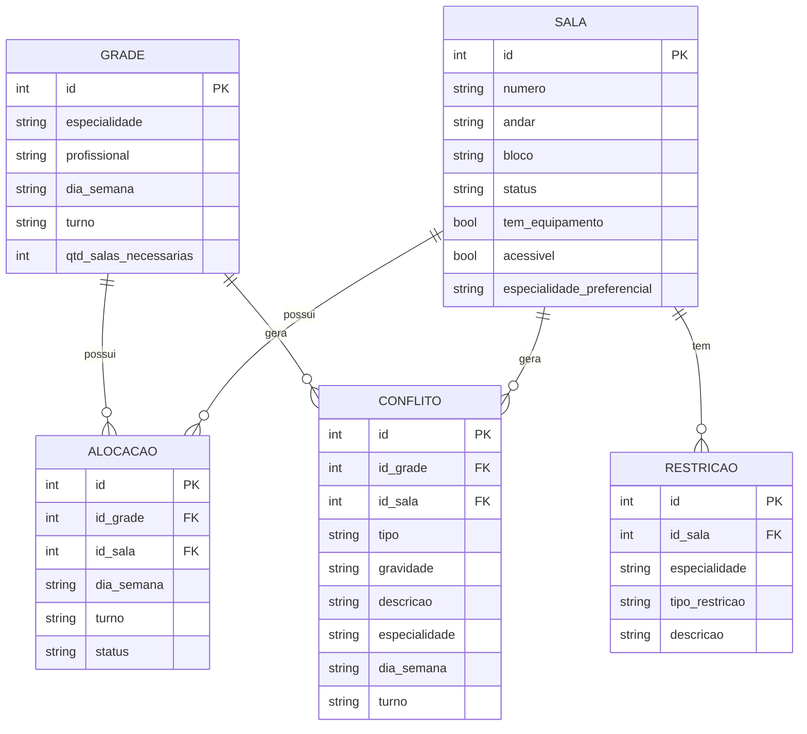

# Modelo de Dados e Dicionário

## 1. Modelo Entidade-Relacionamento

## 2. Dicionário de Dados

### Grade

| Campo | Tipo | Descrição |
|---|---|---|
| id | int | Identificador |
| especialidade | string | Especialidade da grade |
| profissional | string | Profissional encarregado |
| dia_semana | string | Dia da semana |
| turno | string | Turno (Manhã ou Tarde) |
| qtd_salas_necessarias | int | Quantidade de salas necessarias na grade |

### Sala

| Campo | Tipo | Descrição |
|---|---|---|
| id | int | Identificador |
| numero | string | Numero da sala |
| andar | string | Andar aonde está localizada a sala |
| bloco | string | Bloco aonde está localizada a sala |
| status | string | Status atual da sala (Ocupado, Livre) |
| tem_equipamento | bool | Possui equipamento especializado |
| acessivel | bool | É acessivel |
| especialidade_preferencial | string | Especialidade preferencial para a sala |

### Restricao

| Campo | Tipo | Descrição |
|---|---|---|
| id | int | Identificador |
| id_sala | int |Identificador da sala|
| especialidade | string | Especialidade |
| tipo_restricao | string | tipo da restrição |
| descricao | string | Descrição da restrição em detalhes |

### Alocacao

| Campo | Tipo | Descrição |
|---|---|---|
| id | int | Identificador |
| id_grade | int | Identificador da grade |
| id_sala | int | Identificador da sala |
| dia_semana | string | Dia da semana |
| turno | string | Turno (Manhã ou Tarde) |
| status | string | Status atual da sala (Ocupado, Livre) |

### Conflito

| Campo | Tipo | Descrição |
|---|---|---|
| id | int | Identificador |
| id_grade | int | Identificador da grade |
| id_sala | int | Identificador da sala |
| tipo | string | Tipo do conflito |
| gravidade | string | Nivel de gravidade do conflito |
| descricao | string | Descrição detalhado do conflito |
| especialidade | string | Especialidade onde possui conflito |
| dia_semana | string | Dia da semana |
| turno | string | Turno (Manhã ou Tarde) |

## 3. Regras de Integridade

* Salas em reforma ou manutenção não devem ser utilizadas.
* Ortopedia deve priorizar salas acessíveis e andares baixos.
* Oftalmologia exige salas com equipamentos específicos.
* Especialidades devem preferencialmente ocupar salas próximas.
* A mesma sala não deve ser associada a mais de uma grade no mesmo turno.
* O sistema deve registrar responsável pela alteração, data, hora e as salas (anterior e nova) no histórico de uso.