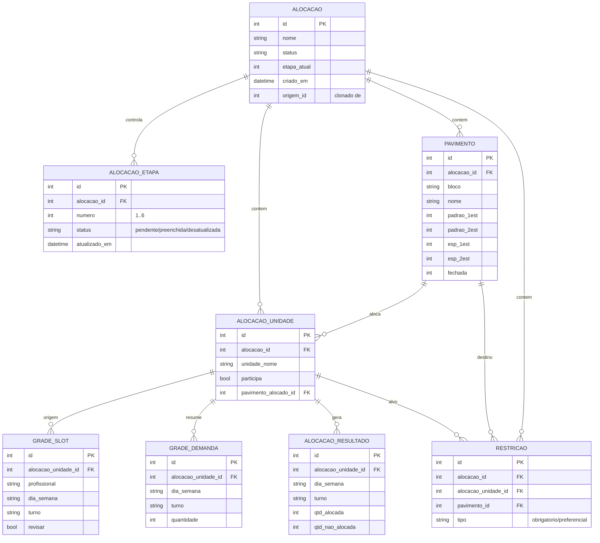
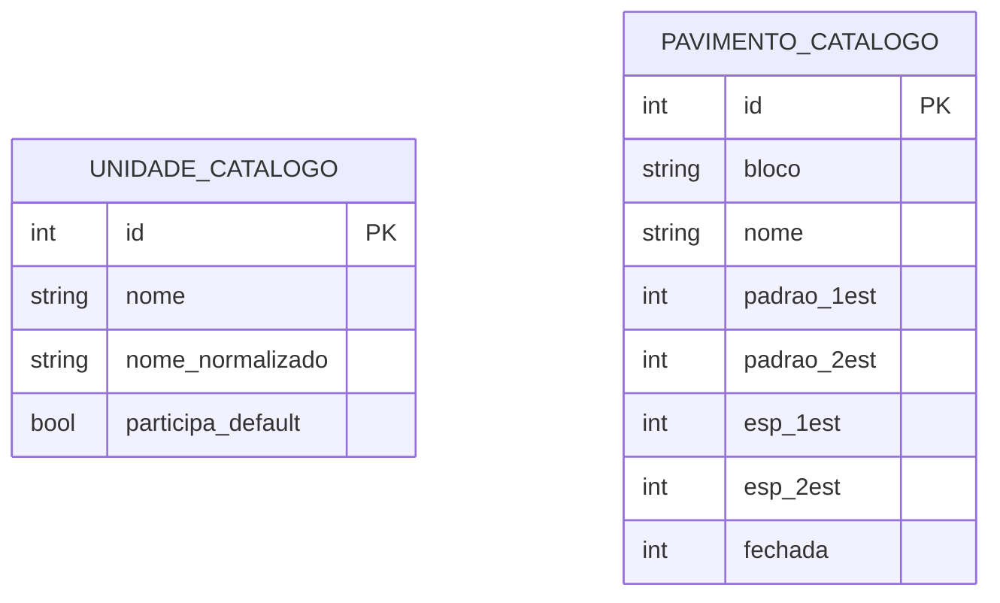

# Modelo de Dados e Dicionário

O centro do modelo é a entidade **Alocação** — um "cenário" completo e autocontido. Tudo que um cenário usou (unidades, grades, salas, restrições e resultado) pendura nele. Ao lado ficam os catálogos globais, que sobrevivem entre cenários e pré-preenchem cada novo. A persistência é em SQLite, com esquema versionado por Alembic.

## 1. Modelo Entidade-Relacionamento

```mermaid
erDiagram
    ALOCACAO ||--o{ ALOCACAO_ETAPA : controla
    ALOCACAO ||--o{ ALOCACAO_UNIDADE : contem
    ALOCACAO ||--o{ PAVIMENTO : contem
    ALOCACAO ||--o{ RESTRICAO : contem
    ALOCACAO_UNIDADE ||--o{ GRADE_SLOT : origem
    ALOCACAO_UNIDADE ||--o{ GRADE_DEMANDA : resume
    ALOCACAO_UNIDADE ||--o{ ALOCACAO_RESULTADO : gera
    PAVIMENTO ||--o{ ALOCACAO_UNIDADE : aloca
    ALOCACAO_UNIDADE ||--o{ RESTRICAO : alvo
    PAVIMENTO ||--o{ RESTRICAO : destino

    ALOCACAO {
        int id PK
        string nome
        string status
        int etapa_atual
        datetime criado_em
        int origem_id "clonado de"
    }
    ALOCACAO_ETAPA {
        int id PK
        int alocacao_id FK
        int numero "1..6"
        string status "pendente/preenchida/desatualizada"
        datetime atualizado_em
    }
    ALOCACAO_UNIDADE {
        int id PK
        int alocacao_id FK
        string unidade_nome
        bool participa
        int pavimento_alocado_id FK
    }
    PAVIMENTO {
        int id PK
        int alocacao_id FK
        string bloco
        string nome
        int padrao_1est
        int padrao_2est
        int esp_1est
        int esp_2est
        int fechada
    }
    RESTRICAO {
        int id PK
        int alocacao_id FK
        int alocacao_unidade_id FK
        int pavimento_id FK
        string tipo "obrigatorio/preferencial"
    }
    GRADE_SLOT {
        int id PK
        int alocacao_unidade_id FK
        string profissional
        string dia_semana
        string turno
        bool revisar
    }
    GRADE_DEMANDA {
        int id PK
        int alocacao_unidade_id FK
        string dia_semana
        string turno
        int quantidade
    }
    ALOCACAO_RESULTADO {
        int id PK
        int alocacao_unidade_id FK
        string dia_semana
        string turno
        int qtd_alocada
        int qtd_nao_alocada
    }
```

Os catálogos globais ficam fora do cenário e são semeados com o mapa real do HC:

```mermaid
erDiagram
    UNIDADE_CATALOGO {
        int id PK
        string nome
        string nome_normalizado
        bool participa_default
    }
    PAVIMENTO_CATALOGO {
        int id PK
        string bloco
        string nome
        int padrao_1est
        int padrao_2est
        int esp_1est
        int esp_2est
        int fechada
    }
```

## 2. Dicionário de Dados

### alocacao — o cenário (raiz do histórico)
| Campo | Tipo | Descrição |
|---|---|---|
| id | int | Identificador |
| nome | string | Nome do cenário |
| status | string | rascunho, em_andamento ou concluida |
| etapa_atual | int | Etapa em que o gestor está (1 a 6) |
| criado_em | datetime | Data/hora de criação |
| origem_id | int? | Cenário de onde foi clonado (nulo se original) |

### alocacao_etapa — status das 6 etapas
| Campo | Tipo | Descrição |
|---|---|---|
| id | int | Identificador |
| alocacao_id | int | Cenário |
| numero | int | Número da etapa (1 a 6) |
| status | string | pendente, preenchida ou desatualizada |
| atualizado_em | datetime? | Última mudança de status |

### alocacao_unidade — clínicas do cenário
| Campo | Tipo | Descrição |
|---|---|---|
| id | int | Identificador |
| alocacao_id | int | Cenário |
| unidade_nome | string | Nome da unidade funcional (clínica) |
| participa | bool | Se entra na alocação (SIM/NÃO da etapa 2) |
| pavimento_alocado_id | int? | Pavimento onde ficou na semana (preenchido pela etapa 5) |

### pavimento — estrutura física do cenário
| Campo | Tipo | Descrição |
|---|---|---|
| id | int | Identificador |
| alocacao_id | int | Cenário |
| bloco | string | Bloco (ex.: "Bloco E") |
| nome | string | Pavimento/andar (ex.: "2º Pavimento") |
| padrao_1est | int | Nº de salas padrão de 1 estação |
| padrao_2est | int | Nº de salas padrão de 2 estações |
| esp_1est | int | Nº de salas especializadas de 1 estação |
| esp_2est | int | Nº de salas especializadas de 2 estações |
| fechada | int | Nº de salas fechadas (não entram na capacidade) |

> A **capacidade em estações** é derivada: `1×padrão(1est) + 2×padrão(2est) + 1×esp(1est) + 2×esp(2est)`. Uma sala de 2 estações comporta dois atendimentos ao mesmo tempo.

### restricao — obrigatoriedades e preferências
| Campo | Tipo | Descrição |
|---|---|---|
| id | int | Identificador |
| alocacao_id | int | Cenário |
| alocacao_unidade_id | int | Clínica alvo |
| pavimento_id | int | Pavimento destino |
| tipo | string | obrigatorio (rígida) ou preferencial (flexível) |

### grade_slot — camada de origem da demanda
| Campo | Tipo | Descrição |
|---|---|---|
| id | int | Identificador |
| alocacao_unidade_id | int | Clínica |
| profissional | string | Profissional da grade |
| dia_semana | string | segunda…sexta |
| turno | string | manha ou tarde |
| revisar | bool | Profissional em duas clínicas no mesmo turno (~7% dos casos) |

> Um slot por profissional × dia × turno já tratado (~1.400 linhas no arquivo real). Não guarda especialidade nem condição de atendimento — descartadas no tratamento.

### grade_demanda — camada derivada (o que a etapa 2 edita)
| Campo | Tipo | Descrição |
|---|---|---|
| id | int | Identificador |
| alocacao_unidade_id | int | Clínica |
| dia_semana | string | segunda…sexta |
| turno | string | manha ou tarde |
| quantidade | int | Nº de grades da unidade naquele dia/turno |

### alocacao_resultado — o resultado por turno (etapa 6 edita)
| Campo | Tipo | Descrição |
|---|---|---|
| id | int | Identificador |
| alocacao_unidade_id | int | Clínica |
| dia_semana | string | segunda…sexta |
| turno | string | manha ou tarde |
| qtd_alocada | int | Grades atendidas naquele turno |
| qtd_nao_alocada | int | Grades sem sala naquele turno |

### unidade_catalogo / pavimento_catalogo — catálogos globais
Sobrevivem entre cenários. `unidade_catalogo` guarda a lista real de unidades e se cada uma participa do ambulatório por padrão (`participa_default`); `pavimento_catalogo` guarda a estrutura do prédio (10 pavimentos, 231 estações) para pré-preencher cada novo cenário.

## 3. Regras de Integridade

* Cada clínica participante recebe **um único pavimento** para a semana inteira; o que varia entre turnos é quantas salas ela usa.
* Em cada turno, a soma das grades das clínicas de um pavimento não passa da capacidade em estações — exceto sob obrigatoriedade.
* Só a **obrigatoriedade** força uma clínica a um pavimento e pode gerar grade não alocada; a **preferência** cede quando o pavimento não a comporta inteira.
* A capacidade de um pavimento é sempre derivada das contagens de salas, nunca digitada.
* `qtd_alocada + qtd_nao_alocada` de um turno é sempre igual à demanda daquele turno.
* A demanda (`grade_demanda`) é uma projeção fiel dos slots (`grade_slot`) e pode ser recalculada sem reimportar.
* Excluir um cenário remove em cascata todos os seus insumos e resultado; os catálogos globais permanecem.
